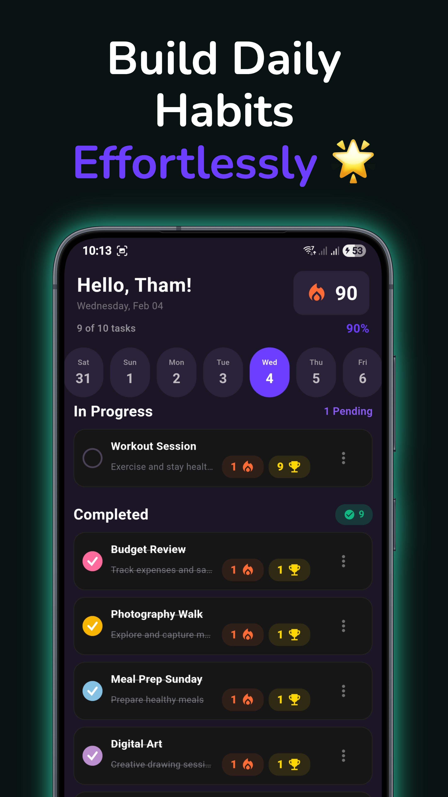
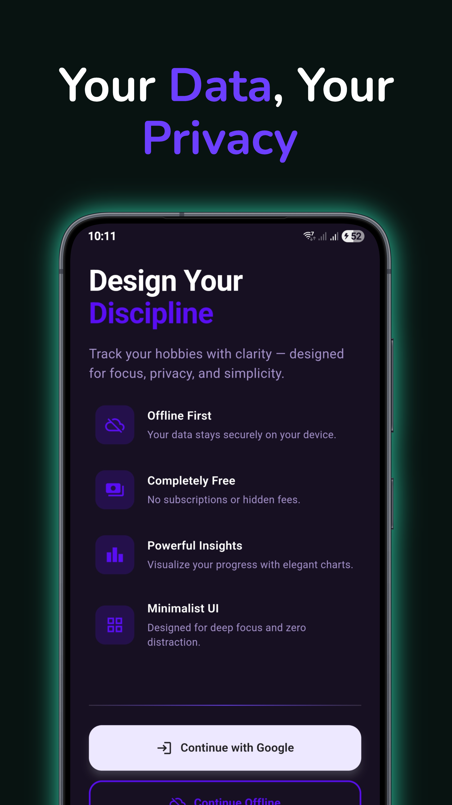
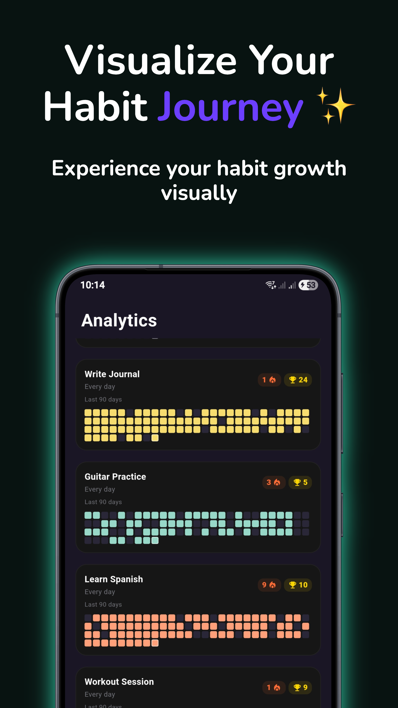
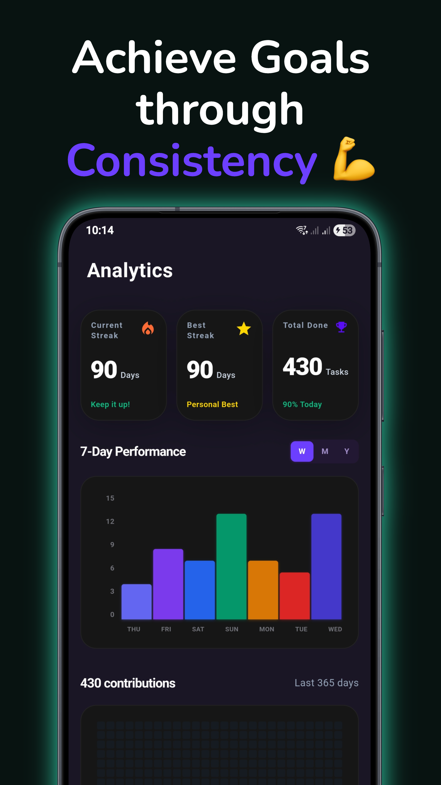

<div align="center">

# 🎯 Hobbyist

### Track your hobbies with discipline and motivation

[](https://flutter.dev)
[](https://dart.dev)
[](https://firebase.google.com)

**A minimalist Flutter application with a GitHub-style contribution chart to build lasting habits** 🚀

[Features](#-features) • [Screenshots](#-screenshots) • [Installation](#-installation) • [Usage](#-usage) • [Download](#-download)







</div>

---

## ✨ Features

### 🎨 **Hobby Management**
- ➕ **Create & Edit Hobbies** - Add custom hobbies with names, notes, colors, and priorities
- 🎨 **Custom Colors** - Choose from a vibrant color palette to personalize each hobby
- ⭐ **Priority Levels** - Mark hobbies as Low, Medium, or High priority
- 🔄 **Flexible Repeat Modes** - Daily, specific weekdays, or custom schedules
- 🗑️ **Easy Management** - Edit or delete hobbies anytime with intuitive UI

### 📊 **Tracking & Visualization**
- ✅ **One-Tap Completion** - Mark hobbies complete with satisfying animations
- 📈 **GitHub-Style Contribution Chart** - Beautiful heatmap showing 12 weeks of activity
- 🔥 **Streak Tracking** - Monitor current and longest streaks for each hobby
- 📉 **Analytics Dashboard** - Comprehensive statistics and insights
- 📅 **Historical Data** - View completion patterns over time

### 🔔 **Smart Reminders**
- ⏰ **Daily Notifications** - Never miss a hobby with customizable reminder times
- 🌍 **Timezone Support** - Notifications adjust to your local timezone
- 🔕 **Granular Control** - Enable/disable reminders per hobby

### 💾 **Data & Privacy**
- 🗄️ **Local-First Architecture** - All data stored securely in SQLite
- 🔒 **Privacy-First** - No hobby data sent to servers
- 📴 **Offline Support** - Works perfectly without internet
- ☁️ **Optional Cloud Sync** - Google Sign-In for identity (no data sync yet)

### 🎉 **User Experience**
- 💬 **Motivational Quotes** - Random inspirational messages on every visit
- 🔊 **Completion Sounds** - Satisfying audio feedback on task completion
- 🎭 **Smooth Animations** - Delightful UI transitions and celebrations
- 🌙 **Beautiful Dark Theme** - Easy on the eyes with purple accents
- 🚀 **Fast & Responsive** - Optimized performance on all devices

### 🔥 **Firebase Integration**
- 📊 **Analytics** - Track app usage patterns (no personal data)
- 💥 **Crashlytics** - Automatic crash reporting for better stability
- ⚡ **Performance Monitoring** - Optimize app speed and responsiveness
- 🎛️ **Remote Config** - Feature flags and A/B testing
- 🔐 **Authentication** - Google Sign-In (optional)

---


## 🚀 Installation

### Prerequisites
- **Flutter SDK** `>=3.0.0` ([Install Flutter](https://docs.flutter.dev/get-started/install))
- **Dart SDK** `>=3.0.0` (included with Flutter)
- **Android Studio** or **Xcode** (for mobile development)
- **Git** for cloning the repository

### 📦 Setup Instructions

1. **Clone the repository**
   ```bash
   git clone https://github.com/yourusername/hobbyist.git
   cd hobbyist
   ```

2. **Install dependencies**
   ```bash
   flutter pub get
   ```

3. **Configure Firebase (Optional)**
   - For Google Sign-In and Firebase features, add:
     - `android/app/google-services.json` (Android)
     - `ios/Runner/GoogleService-Info.plist` (iOS)
   - See [QUICKSTART.md](QUICKSTART.md) for detailed Firebase setup

4. **Run the app**
   ```bash
   flutter run
   ```

5. **Build for release**
   ```bash
   # Android APK
   flutter build apk --release
   
   # iOS
   flutter build ios --release
   
   # Or use the build script
   ./build-apk.sh
   ```

---

## 📖 Usage

### Getting Started

1. **🏁 First Launch** - Enter your name to personalize the experience
2. **➕ Add Your First Hobby** - Tap the + button and fill in:
   - Hobby name (e.g., "Reading", "Exercise")
   - Optional notes
   - Choose a color
   - Set priority
   - Select repeat mode
   - Configure reminder time

3. **✅ Track Daily** - Tap any hobby card to mark it complete for today
4. **📊 Monitor Progress** - View the contribution chart and analytics
5. **⚙️ Customize** - Adjust settings, notifications, and preferences

### Advanced Features

- **📅 Edit Completions** - Long-press on chart to modify past entries
- **🔔 Smart Reminders** - Set different reminder times for each hobby
- **⭐ Prioritize** - Sort hobbies by priority in settings
- **📈 Analytics Deep Dive** - Explore detailed statistics per hobby
- **☁️ Google Sign-In** - Optional authentication for future cloud features

---

## 📥 Download

### Android
- **Min SDK**: Android 6.0 (API 23)
- **Target SDK**: Latest
- **Download APK**: Check `builds/` directory or [Releases](https://github.com/yourusername/hobbyist/releases)

### iOS
- **Min iOS**: 11.0
- **TestFlight**: Coming soon

---

## 🧪 Testing & Coverage

### Run Tests
```bash
# All tests
flutter test

# Unit tests only
flutter test test/unit/

# Widget tests only
flutter test test/widget/

# With coverage
flutter test --coverage
```

### Coverage Report
- ✅ **Unit Tests**: Services, models, and business logic
- ✅ **Widget Tests**: UI components and screens
- 📊 **Coverage Report**: Available in `coverage/lcov.info`

---

## 🛠️ Tech Stack

### Core
- **Flutter** - UI framework
- **Dart** - Programming language
- **SQLite** (via `sqflite`) - Local database
- **Provider Pattern** - State management

### Key Dependencies
- 🎨 `flutter_colorpicker` - Color selection
- 📅 `intl` - Date formatting
- 🔔 `flutter_local_notifications` - Reminder system
- 🌍 `timezone` - Timezone support
- 🔊 `audioplayers` - Sound effects
- 📦 `shared_preferences` - Settings storage
- 🔥 `firebase_core`, `firebase_auth`, `firebase_analytics` - Firebase services
- 🔐 `google_sign_in` - Google authentication

---

## 📂 Project Structure

```
hobbyist/
├── lib/
│   ├── main.dart                      # App entry point
│   ├── models/
│   │   └── hobby.dart                 # Hobby model with computed properties
│   ├── services/                      # Business logic (singleton pattern)
│   │   ├── hobby_service.dart         # CRUD operations
│   │   ├── auth_service.dart          # Google Sign-In
│   │   ├── notification_service.dart  # Local notifications
│   │   ├── quote_service.dart         # Motivational quotes
│   │   ├── sound_service.dart         # Audio feedback
│   │   ├── analytics_service.dart     # Firebase Analytics
│   │   ├── crashlytics_service.dart   # Crash reporting
│   │   └── remote_config_service.dart # Feature flags
│   ├── database/
│   │   └── database_helper.dart       # SQLite schema & migrations
│   ├── screens/                       # Full-page views
│   │   ├── splash_screen.dart
│   │   ├── landing_screen.dart
│   │   ├── name_input_screen.dart
│   │   ├── daily_tasks_screen.dart    # Main dashboard
│   │   ├── add_hobby_screen.dart
│   │   ├── analytics_screen.dart
│   │   └── settings_screen.dart
│   └── widgets/                       # Reusable components
│       ├── contribution_chart.dart    # GitHub-style heatmap
│       ├── animated_checkbox.dart
│       └── tada_animation.dart
├── test/                              # Test suites
│   ├── unit/                          # Service & model tests
│   └── widget/                        # UI component tests
├── assets/
│   ├── sounds/                        # Audio files
│   └── images/                        # Icons & logos
├── design/
│   └── app_screenshots/               # App screenshots
├── docs/                              # Documentation
│   ├── DATABASE_SCHEMA.md
│   └── FIREBASE_FEATURES_STATUS.md
└── pubspec.yaml                       # Dependencies
```

---

## 📚 Documentation

- 📖 [Quickstart Guide](QUICKSTART.md) - Google Sign-In setup
- 🔑 [Google Sign-In Setup](GOOGLE_SIGNIN_SETUP.md) - OAuth configuration
- 🗄️ [Database Schema](docs/DATABASE_SCHEMA.md) - SQLite structure
- 🔥 [Firebase Features](docs/FIREBASE_FEATURES_STATUS.md) - Integration status
- 📝 [Privacy Policy](PRIVACY_POLICY.md) - Data handling
- 🚀 [Release Notes](RELEASE_NOTES.md) - Version history

---

## 🤝 Contributing

This is a personal learning project, but suggestions and feedback are welcome! Feel free to:
- 🐛 Report bugs via issues
- 💡 Suggest new features
- 📖 Improve documentation
- ⭐ Star the repo if you find it useful

---

## 📄 License

This project is created for **personal use and learning purposes**. Not licensed for commercial use.

---

## 🙏 Acknowledgments

- Inspired by GitHub's contribution graph
- Built with ❤️ using Flutter
- Icons and design inspired by Material Design

---

<div align="center">

### Made with 💜 by a hobbyist, for hobbyists

**Start building better habits today!** 🎯

</div>
